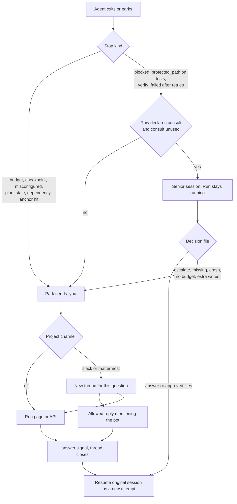
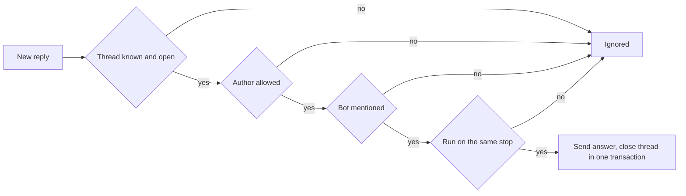
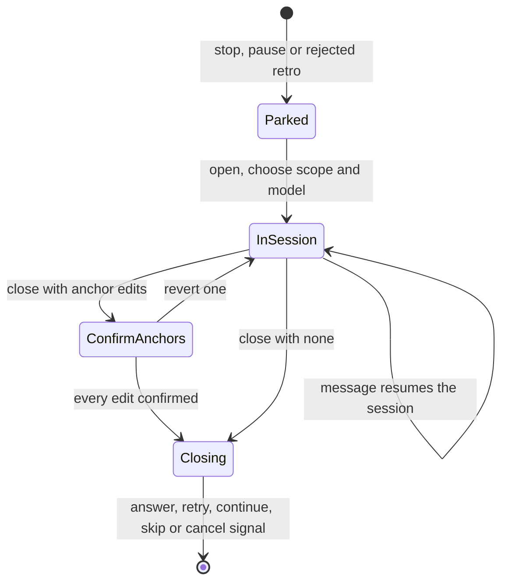

# Flows

## A stop, from agent to answer

```mermaid
flowchart TD
  A[Agent exits or parks] --> B{Stop kind}
  B -->|budget, checkpoint, misconfigured,<br/>plan_stale, dependency, anchor hit| H[Park needs_you]
  B -->|blocked, protected_path on tests,<br/>verify_failed after retries| C{Row declares consult<br/>and consult unused}
  C -->|no| H
  C -->|yes| D[Senior session, Run stays running]
  D --> E{Decision file}
  E -->|answer or approved files| F[Resume original session as a new attempt]
  E -->|escalate, missing, crash,<br/>no budget, extra writes| H
  H --> I{Project channel}
  I -->|off| J[Run page or API]
  I -->|slack or mattermost| K[New thread for this question]
  K --> L[Allowed reply mentioning the bot]
  L --> M[answer signal, thread closes]
  K --> J
  J --> M
  M --> F
```

## Reply checks, first failure stops

```mermaid
flowchart LR
  R[New reply] --> T{Thread known and open}
  T -->|no| X[Ignored]
  T -->|yes| U{Author allowed}
  U -->|no| X
  U -->|yes| V{Bot mentioned}
  V -->|no| X
  V -->|yes| W{Run on the same stop}
  W -->|no| X
  W -->|yes| Y[Send answer, close thread in one transaction]
```

## Operator senior session

```mermaid
stateDiagram-v2
  [*] --> Parked: stop, pause or rejected retro
  Parked --> InSession: open, choose scope and model
  InSession --> InSession: message resumes the session
  InSession --> ConfirmAnchors: close with anchor edits
  ConfirmAnchors --> InSession: revert one
  ConfirmAnchors --> Closing: every edit confirmed
  InSession --> Closing: close with none
  Closing --> [*]: answer, retry, continue, skip or cancel signal
```
